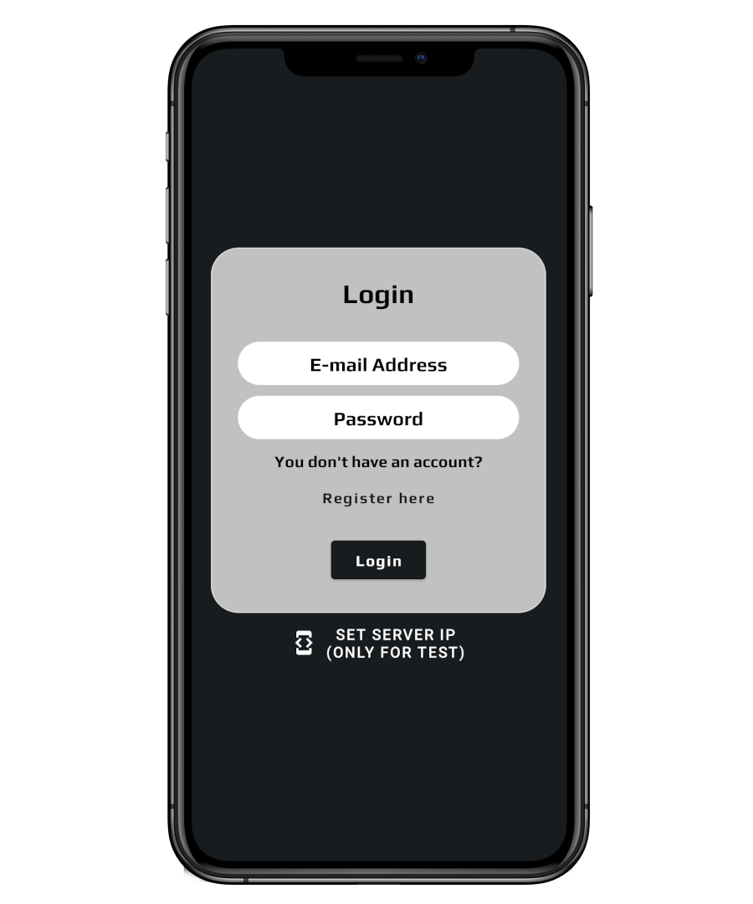

# Stardust Notepad
Ez a dokumentáció a BMSzC Petrik Lajos Két Tanítási Nyelvű Technikumi képzésem során készített csoportos vizsgaremek Mobil alkalmazás Kliensének bemutatására szolgál. Az alkalmazás egy cross-platform jegyzet kezelő, három Klienssel és egy közös szerver oldali Backend-del.

## Telepités
### ⚠ Az alkalmazás működéséhez szükséges a <a href="https://github.com/blaiseludvig/stardust-backend">Backend</a> futtatása.
### Az alkalmazás telepitője elérhető <a href="https://www.dropbox.com/s/s3eae3ewo3sq3zp/app-debug.apk?dl=0" target="_blank">*itt*</a>.

## Az alkalmazás

#### Az alkalmazás frontendjének fejlesztése során az alábbi technológiákat használtam:

+ Kotlin: A Kotlin egy modern, funkcionális és objektumorientált programozási nyelv, amely a Java platformra épül.

+ Lifecycle: A Lifecycle a szoftverkomponensek vagy alkalmazások állapotváltozásait írja le az indulástól a bezárásig.

+ Retrofit2: A Retrofit2 egy Android és Java HTTP kliens könyvtár, amely egyszerűvé teszi az API hívásokat, a RESTful webszolgáltatások használatát és a válaszok feldolgozását.

+ OkHttp3: Az OkHttp3 egy Java és Android HTTP kliens könyvtár, amely lehetővé teszi a HTTP/2 és a WebSocket protokollok támogatását, valamint az egyszerű és hatékony HTTP kérések és válaszok kezelését.

+ Lottie: A Lottie egy Android és iOS számára elérhető, natív animáció lejátszó könyvtár, amely lehetővé teszi a JSON formátumú, tervezők által készített After Effects animációk egyszerű használatát.

+ Material Design: A Material Design egy modern és intuitív dizájnnyelv, amelyet a Google fejlesztett ki, és amely elősegíti az összhangot az alkalmazások között, valamint lehetővé teszi a könnyű és egyértelmű navigációt és az információ szemléletes megjelenítését különböző platformokon.

<table>
<tr>
<td>

</td>
<td>
Ez az első képernyő amit a user lát, a Login Screen. A két beviteli mezőben tudjuk megadni az e-mail címünket és a jelszavunkat, viszont ha nincs még fiókunk, a *register here* felíratnál ezt megtehetjük. Fontos! Mivel a teszt verziót használjuk, a legalsó gomb megnyovásával tudjuk megadni azt az IP címet amin a backend fut.
</td>
</tr>
<tr>
<td>

</td>
<td>
Ez az első képernyő amit a user lát, a Login Screen. A két beviteli mezőben tudjuk megadni az e-mail címünket és a jelszavunkat, viszont ha nincs még fiókunk, a *register here* felíratnál ezt megtehetjük. Fontos! Mivel a teszt verziót használjuk, a legalsó gomb megnyovásával tudjuk megadni azt az IP címet amin a backend fut.
</td>
</tr>
<tr>
<td>

</td>
<td>
Ez az első képernyő amit a user lát, a Login Screen. A két beviteli mezőben tudjuk megadni az e-mail címünket és a jelszavunkat, viszont ha nincs még fiókunk, a *register here* felíratnál ezt megtehetjük. Fontos! Mivel a teszt verziót használjuk, a legalsó gomb megnyovásával tudjuk megadni azt az IP címet amin a backend fut.
</td>
</tr>
<tr>
<td>

</td>
<td>
Ez az első képernyő amit a user lát, a Login Screen. A két beviteli mezőben tudjuk megadni az e-mail címünket és a jelszavunkat, viszont ha nincs még fiókunk, a *register here* felíratnál ezt megtehetjük. Fontos! Mivel a teszt verziót használjuk, a legalsó gomb megnyovásával tudjuk megadni azt az IP címet amin a backend fut.
</td>
</tr>
<tr>
<td>

</td>
<td>
Ez az első képernyő amit a user lát, a Login Screen. A két beviteli mezőben tudjuk megadni az e-mail címünket és a jelszavunkat, viszont ha nincs még fiókunk, a *register here* felíratnál ezt megtehetjük. Fontos! Mivel a teszt verziót használjuk, a legalsó gomb megnyovásával tudjuk megadni azt az IP címet amin a backend fut.
</td>
</tr>
</table>